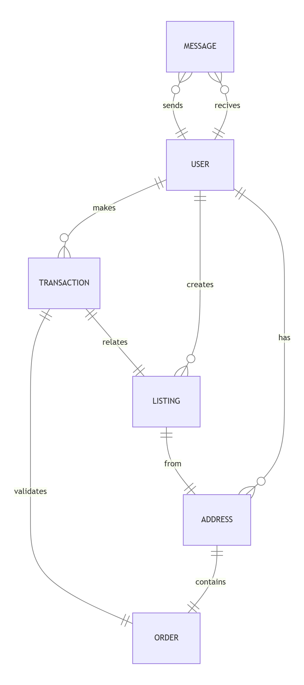

# Design Document

By Adam Reiter

## Scope

The database is meant for online marketplace service with listings. It tries to fulfill basic requirements for such a product. To make it possible, the database's scope contains:

- Users, with basic information which makes it possible to register, including phone number
- Addresses, with possibility to have more than one address per user
- Messages, which users can send to each other including information about state of message (is it delivered? Is it read?)
- Listings, including all neaded details about item which user would like to sell, image, state and category
- Transactions, which contains history of payments and refunds related to listings
- Orders meant to handle deliveries and current status of delivery

Out of scope are documents like invoices, users reviews etc. as it doesn't belong to core functionality.

## Functional Requirements

Marketplace database will support:

- CRUD operations for users
- Multiple addresses for each user, with possibility to mark the main one
- Storing current information about orders
- Keeping information about transactions related to each listing

In the current version, the database doesn't allow a user to create an order without making a transaction.

## Representation

Objects are stored in SQLite tables with provided schema.

### Entities

The online marketplace database contains following entities:
(you can find more details about used data types under https://www.sqlite.org/datatype3.html)

#### Users

The `users` table includes:

- `id`, unique ID of user, stored as `INTEGER`. This column has applied `PRIMARY KEY` constrain.
- `username`, a `TEXT` column which is used as login to service and visible identification, for that purpose also marked with `UNIQUE` constrain.
- `password`, contains hashed password used by user, stored as `TEXT`.
- `first_name` column type of `TEXT` for storing user's first name, used for delivery data.
- `last_name` as with point above, `TEXT` type column, used for user's last name, used for delivery data.
- `phone_number` is column stored as `TEXT` with `UNIQUE` constrain, which
  gives possibility to use it as alternative way of login.
- `is_phone_number_verified`, since SQLite does not provide boolean type, this column has type of `NUMERIC`, which supports type affinity on boolean values. Default value for attribute is `0`.
- `joined` meant to store date, uses `NUMERIC` type - similar to column above, that's SQLite's way to store timestamps. The default value for attribute is provided by constrain `DEFAULT CURRENT_TIMESTAMP`.

All columns from `users` table are required, therefore `NOT NULL` constrain is applied to them (except `PRIMARY KEY`).

#### Addresses

The `addresses` table includes:

- `id`, unique ID of address, stored as `INTEGER`. This column has applied `PRIMARY KEY` constrain.
- `user_id` which is the ID of user who provided address, therefore `FOREIGN KEY` constrain is applied, referencing `id` column from `users` table.
- `country` which specifies user's country as `TEXT`.
- `postal_code` which specifies user's postal code, stored as `TEXT`.
- `street` which specifies user's street, stored as `TEXT`.
- `house_number` which specifies user's house number, represented as `TEXT`.
- `main` which marks if given address is user's main/default. This boolean value is represented as `NUMERIC` and by default equals `0` (`FALSE`).

`NOT NULL` constrain is applied on all columns without `PRIMARY KEY` or `FOREIGN KEY`, except `street` - not every address has it.

#### Messages

The `messages` table includes:

- `id`, unique ID of message, stored as `INTEGER`. This column has applied `PRIMARY KEY` constrain.
- `from_user_id` which is ID of user who sent message as an `INTEGER`. This column has `FOREIGN KEY` applied.
- `to_user_id` which is ID of user who received message as an `INTEGER`. This column has `FOREIGN KEY` applied.
- `sent_timestamp` which is timestamp at which message was sent, stored as `NUMERIC`.
- `status` which represents status of message as `TEXT`. This column has additional check for data correction, thus value of `status` is rather `sent`, `delivered` or `read`.
- `content` which stores content of message as `TEXT`.

All columns from table `messages` are additionally constrain with `NOT NULL` where `PRIMARY KEY` nor 'FOREIGN KEY' was not applied.

#### Listings

The `listings` table includes:

- `id`, unique ID of listing, stored as `INTEGER`. This column has applied `PRIMARY KEY` constrain.
- `seller_id` which is ID of user who created listing as an `INTEGER`. This column has `FOREIGN KEY` applied.
- `address_id` which is ID of address which was chosen by seller, stored as `INTEGER`. This column has `FOREIGN KEY` applied.
- `category` which specifies category of listing, stored as `TEXT`.
- `state` which specifies condition of listed item, stored as `TEXT`. Possible value of `state` is `used`, `new` or `broken`.
- `name`which specifies name of listing, stored as `TEXT`.
- `description` which stores detiled description of listing as `TEXT`.
- `image_URL` which stores URL for picture of listed item as `TEXT`. If no image was provided, the default `no_image.png` will be used.
- `price` which specifies price of listed item, uses `INTEGER` with intend to store value subunit - for example representing $1, `price` will be equal `100`.
- `date` which marks current timestamp when listing was created, stored as `NUMERIC`.
- `is_active` column, `NUMERIC` type of value which indicates if listing is active, by default given value equals `1`.
- `is_deleted` which indicates if listing is deleted - provides possibility of soft deletion. Default value of this `NUMERIC` column is `0`.

In `listings` table, all columns are required and constraint with `NOT NULL` attribute.

#### Transactions

The `transactions` table includes:

- `id`, unique ID of transaction, stored as `INTEGER`. This column has applied `PRIMARY KEY` constrain.
- `listing_id` which indicades ID of listing on which transaction has happend. This `INTEGER` column has `FOREIGN KEY` constrain.
- `buyer_id` which specifies user who made a purchase, it is `INTEGER` column with `FOREIGN KEY` constrain as well.
- `date` which is a timestamp of transaction stored as `NUMERIC`.
- `type` which is `TEXT` column that specifies transactions type. Its value is additionaly checked if it is a `payment` or `refund`.

In `transactions` table columns `date` and `type` have additional `NOT NULL` constrain as it is mandatory for keeping relabile transaction history.

#### Orders

The `orders` table includes:

- `id`, unique ID of order, stored as `INTEGER`. This column has applied `PRIMARY KEY` constrain.
- `transaction_id` which specifies ID of transaction, stored as `INTEGER`. This column has `FOREIGN KEY` constrain applied.
- `delivery_address` which specifies ID of address chosen by buyer, stored as `INTEGER` with `FOREIGN KEY` constrain applied.
- `state` which stores current state of order in column type `TEXT`. Value is checked and allowed are only `ready_to_send`, `in_delivery` or `delivered`.
- `date` which is timestamp of order creation.

In `orders` table columns `state` and `date` have additional `NOT NULL` statement applied.

### Relationships

The diagram below represents relationships between entities captured in the database:

Following information presented on diagram:

- One user can send 0 to many messages to other users and 0 to many messages can be sent to one user. Creating chat groups is not supported.
- One user can create 0 to many addresses on his account, 0 when he just created account and did not make any transaction or listing and many if he wants to.
- One user can create 0 to many listings on marketplace. It is not possible to create a listing in collaboration with any other user.
- One user can make 0 to many transactions on online marketplace, as he can buy nothing or lots of listed items.
- Every listing has exactly one address from which will be shipped in case of transaction made.
- A transaction is related to only one listing and validates one order, which means if a user want to buy more than one thing, he needs to make multiple transactions and orders.
- One Order contains exactly one delivery address.

## Optimizations

Optimization of database is focused mainly on most common searches expected on online markets, for that purpose 2 indexes were created on `listings` table, first on listing `name` and second on `category`.
Taking into account that users will probably look for listings by date or price, indexes on those columns are applied as well. Additionally, a trigger was created which will change the listing to archived after inserting new payment.

## Limitations

The current database does not allow group chat messages, as it would require many too many relations. It is also assumed, that user can make order by making transaction. The consequence of that is every listing requires a separate transaction - user cannot make an order containing multiple listings. This also indicates that creating order must be handled by the service's backend after a valid transaction.
Another limitation is that current implementation supports only one currency - if more than one is needed, another column on listings table should be added.
